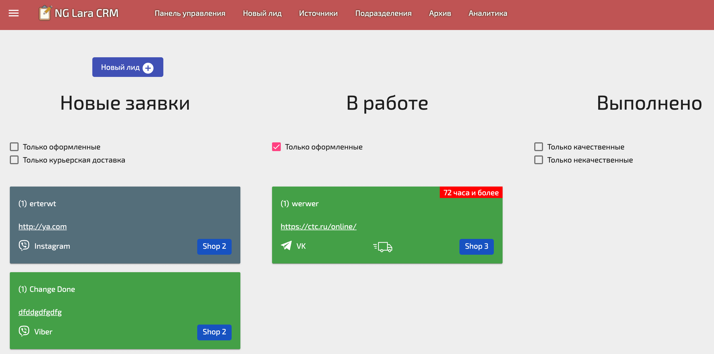

# Ng Laravel CRM

> Build CRM on Angular 11 & Laravel 8
 
 ### [Demo]()


### Get started:
```sh
git clone
```

```sh
Rename or copy .env.example file to .env
```
```sh
php artisan key:generate
```
```sh
make init
```

or

```sh
docker-compose up --build -d
```
```sh
Visit http://localhost:8000 in your browser
```

Run migrate
```sh
make db-migrate
```

Create Test User
```sh
make create-admin
```

Install client packages
```sh
make npm-install
```

Build Client
```sh
make npm-build
```

Login
```sh
admin@gmail.com
```
Password
```sh
password
```